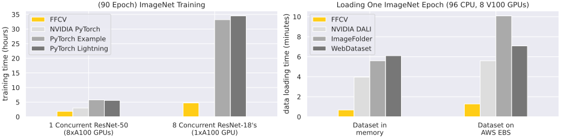
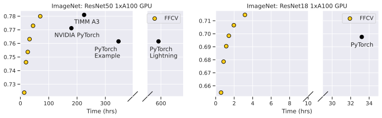

<p align = 'center'>
<em><b>Fast Forward Computer Vision</b>: train models at a fraction of the cost with accelerated data loading!</em>
</p>

<p align = 'center'>
<!-- <br /> -->
[<a href="#install-with-anaconda">install</a>]
[<a href="#quickstart">quickstart</a>]
[<a href="#features">features</a>]
[<a href="https://docs.ffcv.io">docs</a>]
[<a href="https://join.slack.com/t/ffcv-workspace/shared_invite/zt-11olgvyfl-dfFerPxlm6WtmlgdMuw_2A">support slack</a>]
[<a href="https://ffcv.io">homepage</a>]
<br>
Maintainers:
<a href="https://twitter.com/gpoleclerc">Guillaume Leclerc</a>,
<a href="https://twitter.com/andrew_ilyas">Andrew Ilyas</a> and
<a href="https://twitter.com/logan_engstrom">Logan Engstrom</a>
</p>

`ffcv` is a drop-in data loading system that dramatically increases data throughput in model training:

- [Train an ImageNet model](#prepackaged-computer-vision-benchmarks)
on one GPU in 35 minutes (98¢/model on AWS)
- [Train a CIFAR-10 model](https://docs.ffcv.io/ffcv_examples/cifar10.html)
on one GPU in 36 seconds (2¢/model on AWS)
- Train a `$YOUR_DATASET` model `$REALLY_FAST` (for `$WAY_LESS`)

Keep your training algorithm the same, just replace the data loader! Look at these speedups:



`ffcv` also comes prepacked with [fast, simple code](https://github.com/libffcv/imagenet-example) for [standard vision benchmarks]((https://docs.ffcv.io/benchmarks.html)):



## Installation
### Linux
```
conda create -y -n ffcv python=3.9 cupy pkg-config compilers libjpeg-turbo opencv pytorch torchvision cudatoolkit=11.3 numba -c pytorch -c conda-forge
conda activate ffcv
pip install ffcv
```
Troubleshooting note: if the above commands result in a package conflict error, try running ``conda config --env --set channel_priority flexible`` in the environment and rerunning the installation command.

### Windows
* Install <a href="https://opencv.org/releases/">opencv4</a>
  * Add `..../opencv/build/x64/vc15/bin` to PATH environment variable
* Install <a href="https://sourceforge.net/projects/libjpeg-turbo/files/">libjpeg-turbo</a>, download libjpeg-turbo-x.x.x-vc64.exe, not gcc64
  * Add `..../libjpeg-turbo64/bin` to PATH environment variable
* Install <a href="https://www.sourceware.org/pthreads-win32/">pthread</a>, download last release.zip
  * After unzip, rename Pre-build.2 folder to pthread
  * Open `pthread/include/pthread.h`, and add the code below to the top of the file.  
  ```cpp
  #define HAVE_STRUCT_TIMESPEC
  ```
  * Add `..../pthread/dll` to PATH environment variable
* Install <a href="https://docs.cupy.dev/en/stable/install.html#installing-cupy">cupy</a> depending on your CUDA Toolkit version.
* `pip install ffcv`

## Citation
If you use FFCV, please cite it as:

```
@misc{leclerc2022ffcv,
    author = {Guillaume Leclerc and Andrew Ilyas and Logan Engstrom and Sung Min Park and Hadi Salman and Aleksander Madry},
    title = {{FFCV}: Accelerating Training by Removing Data Bottlenecks},
    year = {2022},
    howpublished = {\url{https://github.com/libffcv/ffcv/}},
    note = {commit xxxxxxx}
}
```
(Make sure to replace xxxxxxx above with the hash of the commit used!)

## Quickstart
Accelerate <a href="#features">*any*</a> learning system with `ffcv`.
First,
convert your dataset into `ffcv` format (`ffcv` converts both indexed PyTorch datasets and
<a href="https://github.com/webdataset/webdataset">WebDatasets</a>):
```python
from ffcv.writer import DatasetWriter
from ffcv.fields import RGBImageField, IntField

# Your dataset (`torch.utils.data.Dataset`) of (image, label) pairs
my_dataset = make_my_dataset()
write_path = '/output/path/for/converted/ds.beton'

# Pass a type for each data field
writer = DatasetWriter(write_path, {
    # Tune options to optimize dataset size, throughput at train-time
    'image': RGBImageField(max_resolution=256, jpeg_quality=jpeg_quality),
    'label': IntField()
})

# Write dataset
writer.from_indexed_dataset(my_dataset)
```
Then replace your old loader with the `ffcv` loader at train time (in PyTorch,
no other changes required!):
```python
from ffcv.loader import Loader, OrderOption
from ffcv.transforms import ToTensor, ToDevice, ToTorchImage, Cutout
from ffcv.fields.decoders import IntDecoder, RandomResizedCropRGBImageDecoder

# Random resized crop
decoder = RandomResizedCropRGBImageDecoder((224, 224))

# Data decoding and augmentation
image_pipeline = [decoder, Cutout(), ToTensor(), ToTorchImage(), ToDevice(0)]
label_pipeline = [IntDecoder(), ToTensor(), ToDevice(0)]

# Pipeline for each data field
pipelines = {
    'image': image_pipeline,
    'label': label_pipeline
}

# Replaces PyTorch data loader (`torch.utils.data.Dataloader`)
loader = Loader(write_path, batch_size=bs, num_workers=num_workers,
                order=OrderOption.RANDOM, pipelines=pipelines)

# rest of training / validation proceeds identically
for epoch in range(epochs):
    ...
```
[See here](https://docs.ffcv.io/basics.html) for a more detailed guide to deploying `ffcv` for your dataset.

## Prepackaged Computer Vision Benchmarks
From gridding to benchmarking to fast research iteration, there are many reasons
to want faster model training. Below we present premade codebases for training
on ImageNet and CIFAR, including both (a) extensible codebases and (b)
numerous premade training configurations.

### ImageNet
We provide a self-contained script for training ImageNet <it>fast</it>.
Above we plot the training time versus
accuracy frontier, and the dataloading speeds, for 1-GPU ResNet-18 and 8-GPU
ResNet-50 alongside a few baselines.


| Link to Config                                                                                                                         |   top_1 |   top_5 |   # Epochs |   Time (mins) | Architecture   | Setup    |
|:---------------------------------------------------------------------------------------------------------------------------------------|--------:|--------:|-----------:|--------------:|:---------------|:---------|
| <a href='https://github.com/libffcv/ffcv-imagenet/tree/main/rn50_configs/rn50_88_epochs.yaml'>Link</a> | 0.784 | 0.941  |         88 |       77.2 | ResNet-50      | 8 x A100 |
| <a href='https://github.com/libffcv/ffcv-imagenet/tree/main/rn50_configs/rn50_56_epochs.yaml'>Link</a> | 0.780 | 0.937 |         56 |       49.4 | ResNet-50      | 8 x A100 |
| <a href='https://github.com/libffcv/ffcv-imagenet/tree/main/rn50_configs/rn50_40_epochs.yaml'>Link</a> | 0.772 | 0.932 |         40 |       35.6 | ResNet-50      | 8 x A100 |
| <a href='https://github.com/libffcv/ffcv-imagenet/tree/main/rn50_configs/rn50_32_epochs.yaml'>Link</a> | 0.766 | 0.927 |         32 |       28.7 | ResNet-50      | 8 x A100 |
| <a href='https://github.com/libffcv/ffcv-imagenet/tree/main/rn50_configs/rn50_24_epochs.yaml'>Link</a> | 0.756 | 0.921 |         24 |       21.7  | ResNet-50      | 8 x A100 |
| <a href='https://github.com/libffcv/ffcv-imagenet/tree/main/rn50_configs/rn50_16_epochs.yaml'>Link</a> | 0.738 | 0.908 |         16 |       14.9 | ResNet-50      | 8 x A100 |
| <a href='https://github.com/libffcv/ffcv-imagenet/tree/main/rn18_configs/rn18_88_epochs.yaml'>Link</a> | 0.724 | 0.903   |         88 |      187.3  | ResNet-18      | 1 x A100 |
| <a href='https://github.com/libffcv/ffcv-imagenet/tree/main/rn18_configs/rn18_56_epochs.yaml'>Link</a> | 0.713  | 0.899 |         56 |      119.4   | ResNet-18      | 1 x A100 |
| <a href='https://github.com/libffcv/ffcv-imagenet/tree/main/rn18_configs/rn18_40_epochs.yaml'>Link</a> | 0.706 | 0.894 |         40 |       85.5 | ResNet-18      | 1 x A100 |
| <a href='https://github.com/libffcv/ffcv-imagenet/tree/main/rn18_configs/rn18_32_epochs.yaml'>Link</a> | 0.700 | 0.889 |         32 |       68.9   | ResNet-18      | 1 x A100 |
| <a href='https://github.com/libffcv/ffcv-imagenet/tree/main/rn18_configs/rn18_24_epochs.yaml'>Link</a> | 0.688  | 0.881 |         24 |       51.6 | ResNet-18      | 1 x A100 |
| <a href='https://github.com/libffcv/ffcv-imagenet/tree/main/rn18_configs/rn18_16_epochs.yaml'>Link</a> | 0.669 | 0.868 |         16 |       35.0 | ResNet-18      | 1 x A100 |

**Train your own ImageNet models!** You can <a href="https://github.com/libffcv/imagenet-example/tree/main">use our training script and premade configurations</a> to train any model seen on the above graphs.

### CIFAR-10
We also include premade code for efficient training on CIFAR-10 in the `examples/`
directory, obtaining 93\% top1 accuracy in 36 seconds on a single A100 GPU
(without optimizations such as MixUp, Ghost BatchNorm, etc. which have the
potential to raise the accuracy even further). You can find the training script
<a href="https://github.com/libffcv/ffcv/tree/main/examples/cifar">here</a>.

## Features


Computer vision or not, FFCV can help make training faster in a variety of
resource-constrained settings!
Our <a href="https://docs.ffcv.io/performance_guide.html">performance guide</a>
has a more detailed account of the ways in which FFCV can adapt to different
performance bottlenecks.


- **Plug-and-play with any existing training code**: Rather than changing
  aspects of model training itself, FFCV focuses on removing *data bottlenecks*,
  which turn out to be a problem everywhere from neural network training to
  linear regression. This means that:

    - FFCV can be introduced into any existing training code in just a few
      lines of code (e.g., just swapping out the data loader and optionally the
      augmentation pipeline);
    - You don't have to change the model itself to make it faster (e.g., feel
      free to analyze models *without* CutMix, Dropout, momentum scheduling, etc.);
    - FFCV can speed up a lot more beyond just neural network training---in
      fact, the more data-bottlenecked the application (e.g., linear regression,
      bulk inference, etc.), the faster FFCV will make it!

  See our [Getting started](https://docs.ffcv.io/basics.html) guide,
  [Example walkthroughs](https://docs.ffcv.io/examples.html), and
  [Code examples](https://github.com/libffcv/ffcv/tree/main/examples)
  to see how easy it is to get started!
- **Fast data processing without the pain**: FFCV automatically handles data
  reading, pre-fetching, caching, and transfer between devices in an extremely
  efficiently way, so that users don't have to think about it.
- **Automatically fused-and-compiled data processing**: By either using
  [pre-written](https://docs.ffcv.io/api/transforms.html) FFCV transformations
  or
  [easily writing custom ones](https://docs.ffcv.io/ffcv_examples/custom_transforms.html),
  users can
  take advantage of FFCV's compilation and pipelining abilities, which will
  automatically fuse and compile simple Python augmentations to machine code
  using [Numba](https://numba.pydata.org), and schedule them asynchronously to avoid
  loading delays.
- **Load data fast from RAM, SSD, or networked disk**: FFCV exposes
  user-friendly options that can be adjusted based on the resources
  available. For example, if a dataset fits into memory, FFCV can cache it
  at the OS level and ensure that multiple concurrent processes all get fast
  data access. Otherwise, FFCV can use fast process-level caching and will
  optimize data loading to minimize the underlying number of disk reads. See
  [The Bottleneck Doctor](https://docs.ffcv.io/bottleneck_doctor.html)
  guide for more information.
- **Training multiple models per GPU**: Thanks to fully asynchronous
  thread-based data loading, you can now interleave training multiple models on
  the same GPU efficiently, without any data-loading overhead. See
  [this guide](https://docs.ffcv.io/parameter_tuning.html) for more info.
- **Dedicated tools for image handling**: All the features above work are
  equally applicable to all sorts of machine learning models, but FFCV also
  offers some vision-specific features, such as fast JPEG encoding and decoding,
  storing datasets as mixtures of raw and compressed images to trade off I/O
  overhead and compute overhead, etc. See the
  [Working with images](https://docs.ffcv.io/working_with_images.html) guide for
  more information.

# Contributors

- Guillaume Leclerc
- Logan Engstrom
- Andrew Ilyas
- Sam Park
- Hadi Salman
