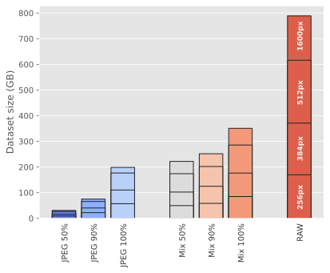
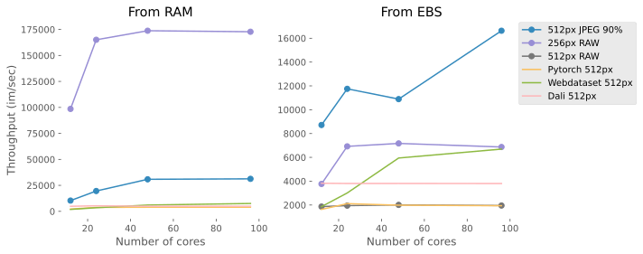

ImageNet Benchmarks
====================

We benchmark our system using the `ImageNet <https://www.image-net.org>`_ dataset,
covering dataset size (storage), data loading,
and end-to-end training.
As we demonstrate below, FFCV significantly outperforms existing systems such as `Pytorch DataLoader <https://pytorch.org/docs/stable/data.html#torch.utils.data.DataLoader>`_, `Webdataset <https://github.com/webdataset/webdataset>`_, and `DALI <https://docs.nvidia.com/deeplearning/dali/user-guide/docs/>`_, while being much easier to use and extend.

Dataset sizes
--------------

In order to provide an idea of how the image encoding settings influence the resulting dataset, we generated multiple ImageNet datasets with various options. We present the results below. For more details about the options, please refer to the :ref:`relevant section<Working with Image Data in FFCV>`.

.. list-table:: Dataset sizes
   :widths: 16 16 16 16 16 16
   :header-rows: 1

   * - Image Format
     - Quality
     - Size @ 256px
     - Size @ 384px
     - Size @ 512px
     - Size @ 1600px
   * - JPEG
     - 50
     - 9.23 GB
     - 16.14 GB
     - 26.35 GB
     - 30.75 GB
   * - JPEG
     - 90
     - 22.01 GB
     - 40.31 GB
     - 65.47 GB
     - 74.98 GB
   * - JPEG
     - 100
     - 57.00 GB
     - 110.21 GB
     - 176.65 GB
     - 198.53 GB
   * - Mix
     - 50
     - 49.59 GB
     - 102.29 GB
     - 173.92 GB
     - 221.76 GB
   * - Mix
     - 90
     - 58.36 GB
     - 124.74 GB
     - 202.04 GB
     - 251.66 GB
   * - Mix
     - 100
     - 84.91 GB
     - 176.43 GB
     - 285.67 GB
     - 350.72 GB
   * - RAW
     - N.A
     - 169.79 GB
     - 371.20 GB
     - 616.18 GB
     - 788.97 GB

Data loading
------------

We selected some of the datasets generated in the section above and measure the time to go through an epoch.

We then measure the data loading performance of FFCV on some of the generated dataset both when loaded from:

- RAM (simulating the case where the dataset is smaller than the amount of RAM available for caching)
- EBS (network attached drives on AWS) to simulate the worst case scenario one would encounter on large datasets that are too big to be cached and even be stored on local storage.

We compare our results against existing data loading platforms:

- `Pytorch DataLoader <https://pytorch.org/docs/stable/data.html#torch.utils.data.DataLoader>`_: This is the default option that comes with the Pytorch library and uses individual JPEG files as a source
- `Webdataset <https://github.com/webdataset/webdataset>`_: This loader requires pre-processed files aggregated in multiple big `.tar` archives.
- `DALI <https://docs.nvidia.com/deeplearning/dali/user-guide/docs/>`_: Data loading pipeline developed by Nvidia, In this experiment we used the default file format which is the same as the Pytorch DataLoader

.. list-table:: Data loading benchmark results (ImageNet)
   :header-rows: 1

   * - Framework
     - Data Source
     - Resolution
     - Mode
     - All cores throughput (images/sec)
   * - FFCV
     - RAM
     - 512
     - JPEG 90%
     - 31278
   * - FFCV
     - RAM
     - 256
     - RAW
     - 172801
   * - FFCV
     - EBS
     - 512
     - RAW
     - 1956
   * - FFCV
     - EBS
     - 512
     - JPEG 90%
     - 16631
   * - FFCV
     - EBS
     - 256
     - RAW
     - 6870

.. note::
    The benchmarks were run on an AWS ``p3dn.24xlarge`` instance.

    For a fair comparison the baseline frameworks were evaluated on similarly resized datasets.

    The data loading pipeline consists in:

    - Loading the images
    - Random resized crop to 224x224xpx
    - Random Flip

End-to-end training
--------------------
